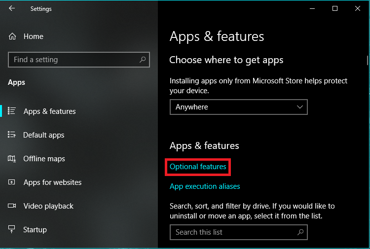
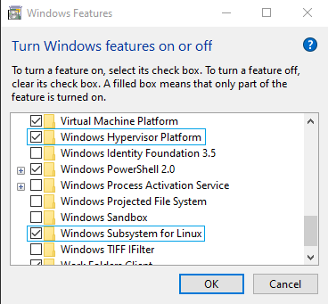
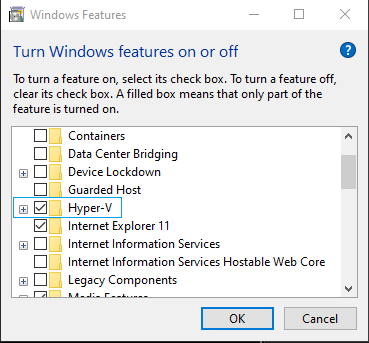

## Docker Setup

#### Double Check System Requirements
- **BEFORE** you download and install Docker make sure you have:
	+ WSL 2 for Windows enabled
		* Hyper-V and Hypervisor: From Start Menu search "Settings" > "Apps" > "Optional Features" > "Related Settings" > "More Windows Features"  

		* Check on "Windows Hypervisor Platform"
	+ Hyper-V backend & Windows containers enabled
		* Same path into "More Windows Features"
		* Check on "Virtual Machine Platform"  

  

**NOTE**: changing these settings will require a restart of your computer. 

`Hyper-V`: Provides services and management tools for creating and running virtual machines and their resources.  
`Windows Hypervisor Platform`: 
Enables virtualization software to run on the Windows hypervisor  
`Windows Subsystem for Linux`: Provides services and environments for running native user-mode Linux shells and tools on Windows  

#### Download and Install
- go to: https://www.docker.com
- From the menu choose: 'Developers' > 'Docs'
- On that page choose 'Download and Install'
- Choose Docker Desktop for your OS *(I'm on Windows)*

### Installation Process
Navigate to your `Downloads` folder and double-click on the `Docker Desktop Installer`
