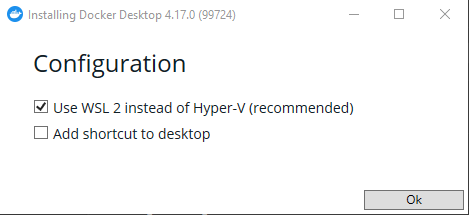
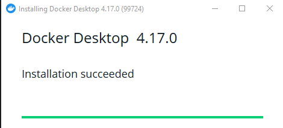
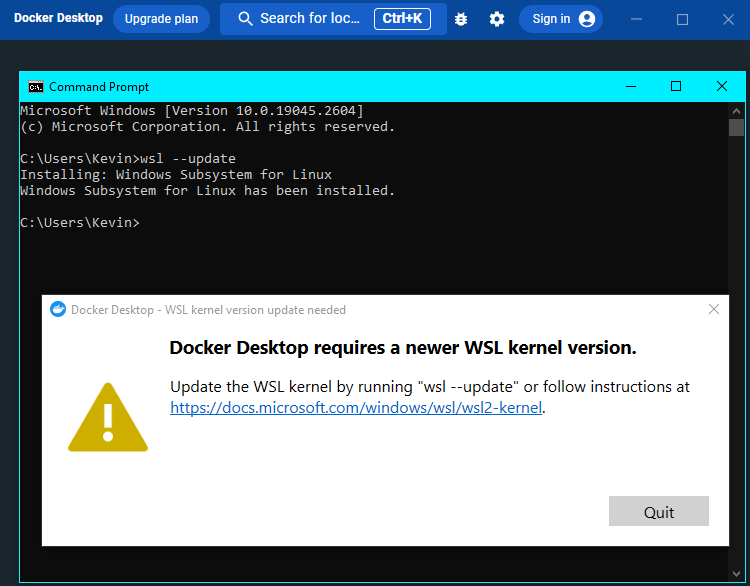

## Docker Setup

#### Double Check System Requirements
- **BEFORE** you download and install Docker make sure you have:
	+ WSL 2 for Windows enabled
		* Hyper-V and Hypervisor: From Start Menu search "Settings" > "Apps" > "Optional Features" > "Related Settings" > "More Windows Features"  

		* Check on "Windows Hypervisor Platform"
	+ Hyper-V backend & Windows containers enabled
		* Same path into "More Windows Features"
		* Check on "Virtual Machine Platform"  

  

**NOTE**: changing these settings will require a restart of your computer.   
**NOTE**: For Windows 11 you may not have or need Hyper-V. This is covered in the installation process.  
`Hyper-V`: Provides services and management tools for creating and running virtual machines and their resources.  
`Windows Hypervisor Platform`: 
Enables virtualization software to run on the Windows hypervisor  
`Windows Subsystem for Linux`: Provides services and environments for running native user-mode Linux shells and tools on Windows  

#### Download and Install
> All provided screenshots are in a Windows 10 environment
- go to: https://www.docker.com
- From the menu choose: 'Developers' > 'Docs'
- On that page choose 'Download and Install'
- Choose Docker Desktop for your OS *(I'm on Windows)*

### Installation Process
- Navigate to your `Downloads` folder and double-click on the `Docker Desktop Installer`
- Make sure use WSL2 instead of Hyper-V is checked
- Adding a Desktop Shortcut is up to you  
  
- Docker will then go through unpacking it's files and installing  
When it's finished you should see this window
  
> The finished window did not automatically close for me. Safe to close.

### Starting up Docker
You may need to sign out and back into your computer
Now you can Navigate to Docker either through your Start Menu or your Desktop if you added a shortcut  
When you open Docker read and accept the Service Agreement  
You may need to update your wsl when you first start Docker.  
To do this simply open a command prompt window and type `wsl --update`  

The process may take a couple minutes  
After the wsl update completes Close and Reopen Docker  

From here Docker should be all set up to go