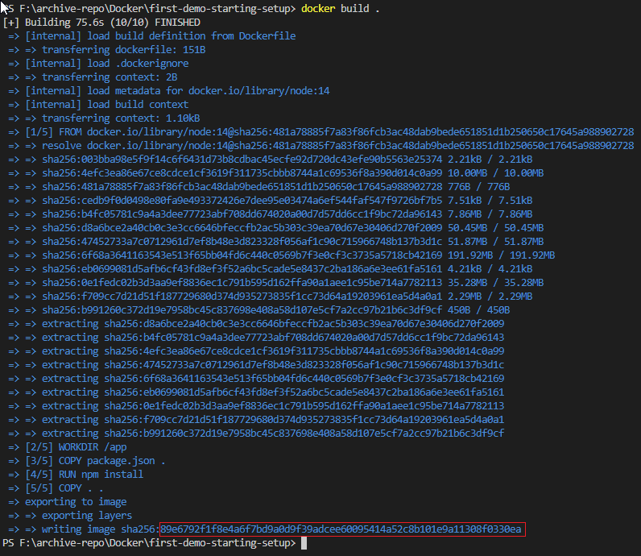
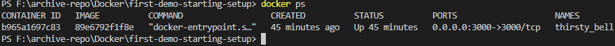

# Docker Tools & Building Blocks

#### A Recap of Where We Are
- We've installed the Docker Engine via Docker Desktop
- Docker Desktop (including Daemon and CLI)
  - a lot of what we will be doing will involve the CLI

#### Coming up
- We will work with something called Docker Hub
  - Service which will allow us to host our images in the cloud/web
  - making it easy to share with other systems and people
- We will also work with a tool called Docker Compose
  - This is a tool which builds on Docker and makes managing more complex containers/multi-container projects easier
- We will also be looking at Kubernetes, this is not yet installed

We also need an IDE configured. VS Code is a simple way to go. You can install the Docker Plugin  
The Prettier plugin is also recommended for formatting code.

## Images
The idea with Docker is to run our code within a container. To do that we first need to create an image 
Containers are always based on images, and we'll learn more about the relation between the two soon.  
To create an image, we create a Dockerfile, simply named `Dockerfile` without any extension. This text file contains a set of instructions used to build a Docker image. The instructions specify  the base image to use, the files and directories to include in the image, the commands to run during the image build process, and other configuration settings. In a simple node.js app we might write a Dockerfile like this:  
```
FROM node:14

WORKDIR /app

COPY package.json .

RUN npm install

COPY . .

EXPOSE 3000

CMD [ "node", "app.mjs" ]
```

The file above can be described as:  
`FROM` - What to use as a base image?  
`WORKDIR` - We have a directory in the container file system  
`COPY` - the package files into the working directories  
`RUN` - any necessary commands  
`COPY` - the rest of the code  
`EXPOSE` - the port  
`CMD` - application commands

These are not the only instructions available in Docker. More will be discussed as we go on.  

With a dockerfile written we will build our image
Open up a Terminal, the integrated VS code terminal works fine  
type the command:  
`docker build .` and press `ENTER`  
This will now build an image based on our Dockerfile. using the `.` in docker build tells it to build the image based on the Dockerfile it finds within the directory that you run the command in. Basically run `docker build .` in the directory where your Dockerfile is stored. Which should be in the root directory of the project you're building an image for.  

After running (on Windows) your output should look something like this:  
  
The character sequence highlighted in red is the image ID. When we enter the command to run this image we will only need to include the first 12 characters of the ID. So in this example the ID would be `89e6792f1f8e`.
**Also**, Docker Desktop has a simple way to copy this ID to your clipboard in the Images tab so you don't have to memorize this whole sequence.  
We can use this ID to run a "Container" based image on this ID with the `docker run` command by adding the ID in a space after `run`.  
But since our Docker image exposed a port (3000) we need to publish that port to the container we're going to run. We do this by adding the `-p` flag to our `docker run` command. See below:
  
`docker -run -p 3000:3000 89e6792f1f8e`  
  
**BEFORE YOU HIT ENTER**  
When hitting `Enter` and running this command it will lock the terminal environment. This is because your container is now running. We now have a running web server.  

In the command we also need to publish port 3000 on port 3000. Which means we can use our local host environment to reach the application running on port 3000 inside of the container. By default there is no connection between container and our host operating system. If we wish to send HTTP requests to an application running inside a container we need to open up the port on the container which we want to communicate. Otherwise it's a locked network inside the container and we can't reach it from the outside.

If you made it this far and visit `localhost:3000` you should see your whitelabel or app page.

To stop the container you can open a new terminal within the project and enter the necessary commands there.

Run `docker ps` in your terminal which whill list all running containers.  
  

Within the NAMES column, which are automatically generated, we can see our image running. We can use that name to stop the container by adding the name to the following command:  
`docker stop thirsty_bell`  
This process may lock your terminal up for a moment. However when it completes shutting down the server, it will set you back down in the command prompt.  

If you try to reload your local host browser window it should error out. The terminal window that was running your docker image should be released as well. We're out of the running process, more commands can be entered.  

## Wrapping Up
- We've successfully installed Docker
- We can run a basic containerized application
- We did this without installing node.js on the system
- We did this without running `npm install`
	+ this is the command that installs many third party dependencies.
		* just think of boxes and boxes of papers being dumped out into your system.
			- This is what npm install does to your system everytime your run it.
- And we were able to bring up a web server and visit it on `localhost:3000`

## This completes the overview of Docker